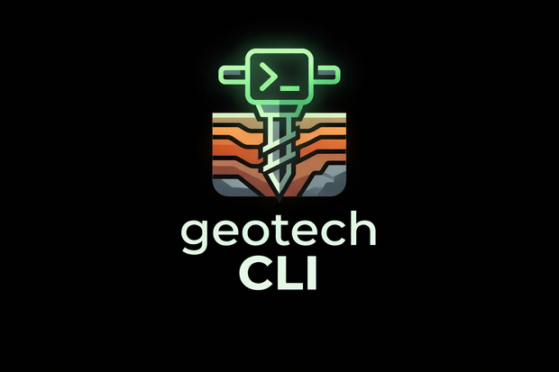

<div align="center">



# geotechCLI

**Open-source agentic AI CLI for geotechnical engineering.**

Deterministic geotechnical engines + LLM reasoning over an evidence-bound GroundModel —
the AI interprets, deterministic code owns every number.

[](https://www.npmjs.com/package/geotechcli)
[](https://www.npmjs.com/package/geotechcli?activeTab=versions)
[](LICENSE)
[](https://github.com/kilickursat/geotechcli-/actions/workflows/ci.yml)
[](https://github.com/sponsors/kilickursat)

[**Website**](https://www.geotechcli.com) · [**Documentation**](https://www.geotechcli.com/docs) · [**Changelog**](https://www.geotechcli.com/changelog) · [**Sponsor the project**](#-community-supported-open-source)

</div>

---

## What is geotechCLI?

geotechCLI turns a folder of geotechnical data — borehole logs, SPT/CPT tables, lab results,
monitoring CSVs, PDF reports — into an **evidence-bound GroundModel** you can calculate against,
visualize, export, and interrogate with an AI agent from your terminal.

The design principle throughout is a strict **trust boundary**:

> **The LLM interprets and orchestrates. Deterministic code owns every number.**
> Calculations come from published methods (Terzaghi, Meyerhof, Boulanger–Idriss, Bishop, …),
> every extracted value carries evidence references back to its source page or row, and anything
> unverified is surfaced as an explicit review gate instead of silently guessed.

## 🤖 AI included — GLM 5.2 free by default

The AI features work **out of the box, free, with no API key and no signup**: geotechCLI ships
connected to a hosted `hosted-beta` provider running **`glm-5.2`** for text/agents and
**`glm-5v-turbo`** for vision (plus `glm-ocr` for PDF/table layout), behind fair rate limits.

Prefer your own models? **BYOK** is first-class: OpenAI, Anthropic, Zhipu/Z.ai,
OpenAI-compatible/OpenRouter, and Hugging Face providers plug into the same evidence contract.

> The hosted API bill is paid by the project. If geotechCLI saves you time,
> [**sponsoring**](#-community-supported-open-source) helps keep the free tier free.

## Quick start

```bash
npm install -g geotechcli          # latest stable
# npm install -g geotechcli@beta   # early-adopter channel

geotech analyze .                  # scan a project folder into a GroundModel (offline, deterministic)
geotech chat                       # AI agent with your project auto-loaded as context
geotech liquefaction --demo        # deterministic liquefaction screening on sample data
```

## Features

**Deterministic engines — free forever, work offline, no key:**

| Command | What it does |
|---------|--------------|
| `geotech bearing` | Bearing capacity — Terzaghi / Meyerhof / Hansen / Vesic |
| `geotech liquefaction` | Liquefaction triggering — Boulanger & Idriss / NCEER |
| `geotech classify` | USCS, RMR89, Q-system classification |
| `geotech pile` | Pile capacity — alpha / beta / SPT methods |
| `geotech slope` | Slope stability — Bishop simplified |
| `geotech retaining` | Earth pressures — Rankine / Coulomb |
| `geotech settlement` | Elastic / consolidation / Schmertmann settlement |
| `geotech seepage` | Deterministic groundwater routing |
| `geotech tunnel` | TBM performance, selection, cutter wear |
| `geotech analyze` | Workspace scan → evidence-bound GroundModel + verifier |
| `geotech signal` | Monitoring analysis — settlement, piezometer, inclinometer, vibration, load tests |
| `geotech viz` / `export` | Interactive plots; CSV, DXF, GeoJSON, AGSi, DIGGS export |

**AI features — powered by the free hosted GLM or your own key:**

| Command | What it does |
|---------|--------------|
| `geotech chat` | Interactive ReAct agent with memory; auto-loads your project dataset |
| `geotech agent` | Project agent — queries the GroundModel, routes work into deterministic tools |
| `geotech ingest` | Evidence-bound extraction from borehole logs and reports (PDF/image) |
| `geotech vision` | Core-box photos, tunnel-face RMR, sensor charts, log photos |
| `geotech gbr` | Interrogate a Geotechnical Baseline Report in the terminal |
| `geotech report` | Draft evidence-first geotechnical reports |
| `geotech ai-classify` | Natural-language soil description → USCS + properties |

**Bundled skills.** Repeatable screening workflows (ground-model building, data-quality review,
parameter triangulation, risk registers, …) ship with the CLI.
Current bundled strong-beta catalog: 49 skills total, including 48 approved executable skills and 1 prompt-only reviewer skill.

**Global flags** on most commands: `--json`, `--plot`, `--save-html <file>`, `--no-open`,
`--verbose`, `--quiet`, `--dry-run`, `--output <file>`, `--no-color`.

## How it works

```
your project folder
   └─ borehole logs · SPT/CPT/lab CSVs · monitoring data · PDF reports
        │
        ▼  deterministic scan + OCR/layout extraction (evidence refs on every value)
   GroundModel  ──────  verifier (review gates, standards readiness, missing-data flags)
        │
        ├─ deterministic engines: bearing · settlement · liquefaction · slope · pile · …
        ├─ visualization / export: plots · GeoJSON · DXF · AGSi · DIGGS
        └─ AI layer: chat/agent query the GroundModel read-only and route work
           into the deterministic tools — they never invent a number
```

Agent quality is enforced, not hoped for: a deterministic **agent-task benchmark** (scripted-model
scenarios, zero network) gates every CI run — tool correctness, evidence citation, review-gate
preservation, and fail-closed guardrails (fabricated values blocked, invented artifacts rejected).

## 💖 Community-supported open source

**Keep geotechCLI open, reliable, and accessible.**

geotechCLI is an Apache-2.0 open-source toolkit for geotechnical engineering. The deterministic
engines remain free for everyone. Sponsorship helps cover hosted AI usage, cross-platform testing,
documentation, security maintenance, and the time required to review contributions and ship
dependable releases.

### Sponsor monthly

| Tier | | Purpose |
|------|--|---------|
| **Community Backer** | **$10/mo** | Help cover hosting, CI, and shared API costs · optional recognition in [SUPPORTERS.md](SUPPORTERS.md) |
| **Project Sustainer** *(recommended)* | **$50/mo** | Support documentation, testing, maintenance, and regular releases · optional recognition · periodic public project updates |
| **Organization Sponsor** | **$100/mo** | For engineering firms, research groups, and universities · optional name or logo recognition on the sponsor page and README |

### Prefer a one-time thank-you?

Contribute **$10, $25, or $50 once — without automatic renewal.** GitHub Sponsors handles one-time
contributions directly, so nothing starts and there is nothing to cancel afterwards.

<div align="center">

[**❤️ Sponsor on GitHub**](https://github.com/sponsors/kilickursat) · [Sponsor on Patreon instead](https://www.patreon.com/16003704/join)

</div>

> **Trust note:** Sponsorship is optional and never changes access to the project. It does not
> purchase engineering approval, an SLA, roadmap control, or a guaranteed feature. Priorities remain
> based on safety, community value, and maintainer capacity.

**Prefer to contribute time?** Report an issue, improve the documentation, propose a test case, or
open a pull request. You never need to be a sponsor to contribute — issues and pull requests are
open to everyone, and sponsorship is never a paywall.

Sponsoring at $500+ or looking for a formal arrangement? Open a
[discussion](https://github.com/kilickursat/geotechcli-/discussions) — organization sponsorship is a
separate conversation.

## Contributing

Contributions are welcome — see [CONTRIBUTING.md](CONTRIBUTING.md) for the dev setup, branch flow
(PRs target `strong-beta`), and the trust-boundary rules every change must respect. Good first
steps: try the CLI on real project data and file issues, improve docs, or pick up a
`good first issue`.

geotechCLI is maintained by [Kursat Kilic](https://github.com/kilickursat), who reviews and merges
all changes.

## Citing geotechCLI

If geotechCLI contributes to your research or engineering work, please cite it
(see [CITATION.cff](CITATION.cff) — GitHub's *Cite this repository* button gives APA/BibTeX):

```bibtex
@software{geotechcli,
  author  = {Kilic, Kursat},
  title   = {geotechCLI: an open-source agentic AI CLI for geotechnical engineering},
  url     = {https://github.com/kilickursat/geotechcli-},
  license = {Apache-2.0},
  year    = {2026}
}
```

## Security & privacy

- Deterministic commands run fully offline; nothing leaves your machine.
- AI commands send only the bounded, evidence-referenced context they need to the configured
  provider; the hosted proxy holds the API key server-side and stores no user documents.
- API keys for BYOK live in your local config (`0600` permissions) and are never transmitted
  anywhere except the provider you chose. Error paths redact key-shaped values.
- Report vulnerabilities privately — see [SECURITY.md](SECURITY.md).

## License

[Apache-2.0](LICENSE) © 2026 Kursat Kilic. The [NOTICE](NOTICE) file travels with redistributions.
