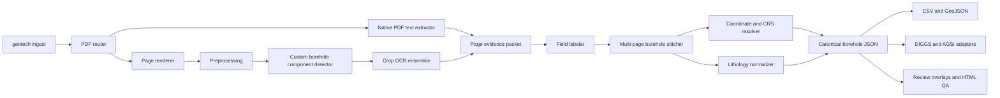
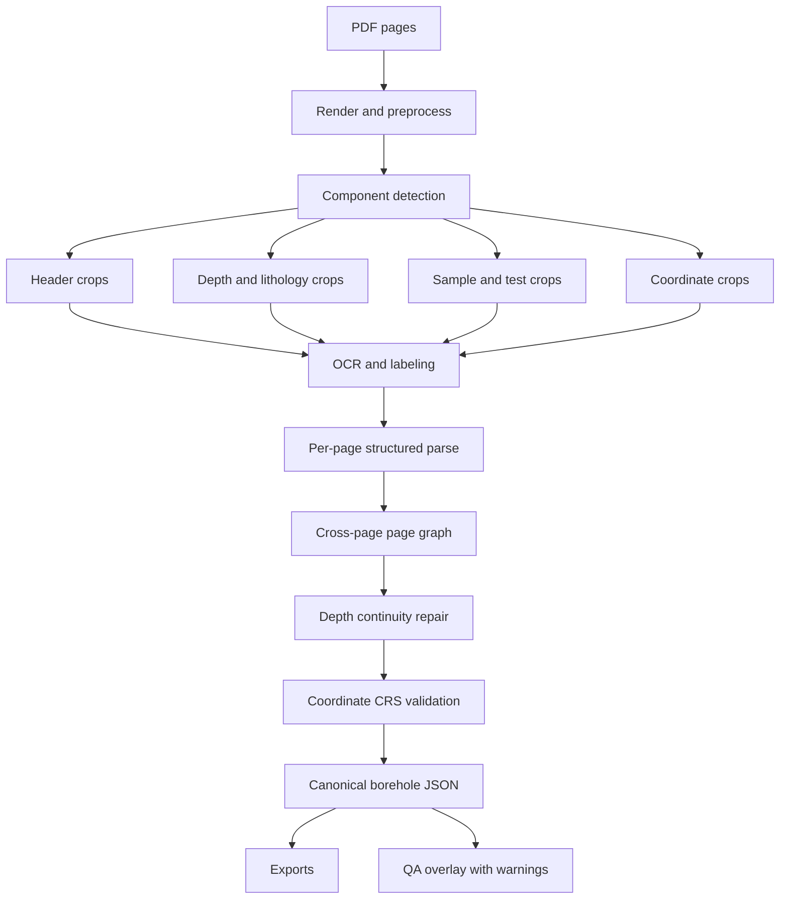

# GeotechCLI Borehole Digitization Architecture for Unstructured Geotechnical PDFs

## Executive summary

GeotechCLI already has a serious ingest foundation. Its public docs show dedicated `borehole-log` and `geotech-document` ingest modes, multi-page borehole PDF processing, resumable segmented jobs for large PDFs, evidence-first HTML review output, and a hosted-beta pipeline that currently runs GLM-OCR layout extraction before visual OCR, with preprocessing that includes deskew, normalized page assets, smarter borehole/table crop candidates, region quality scoring, and page-evidence caching keyed by file/page/model/preprocessing/schema hashes. Recent changelog entries also show rapid hardening for transient JSON failures, mixed successful/failed page checkpoints, coordinate promotion into GroundModel map points, and region-v2 crop routing into OCR before full-page vision OCR. That means the overall direction is right, but the remaining bottleneck is the same one you described: page-local OCR/VLM output is still too brittle for borehole-grade structural continuity and geospatial fidelity. citeturn3view1turn3view2turn25view0turn25view1turn25view2turn25view3turn24view0

The core finding from the literature is that borehole logs are not “just PDFs.” They are irregular tabular diagrams with deformed cells, professional geology symbols, vertically encoded depth logic, and layout exceptions such as the “beard phenomenon” where description cells no longer match formation thickness one-to-one. A borehole-specific extraction paper validated its method on 100 logs of the same specification and still had to combine structural analysis, Hough-based line extraction, corner-based segmentation, OCR, and specialized symbol recognition to achieve robust extraction. Broader document-AI research makes the same point from another angle: OCR error propagation hurts downstream understanding, and layout models trained on narrower corpora degrade on more diverse real-world layouts. citeturn8view0turn4search1turn4search5turn5search2

The most important conclusion is that **you should not try to solve borehole digitization with a single generic LLM/VLM prompt**. The best production design for geotechcli is a **hybrid borehole-expert module** that combines: native PDF extraction when available, custom borehole component segmentation, crop-level OCR, domain-tuned line recognition, deterministic multi-page stitching, coordinate/CRS validation, lithology normalization, and human review overlays. General parsers such as PaddleOCR-VL, Docling, Granite-Docling, Surya, Donut, and LayoutLMv3 are useful, but only as components inside a constrained geotechnical pipeline. None of the surveyed general parsers natively claims exact engineering depth continuity, geospatial CRS disambiguation, or borehole-interval repair as a primary task. citeturn9view0turn9view1turn9view2turn9view3turn26view0turn34view0turn32view0turn32view1

If you want **one new general model** to add immediately, the strongest current choice is **PaddleOCR-VL-1.6** because Paddle’s official docs and repo position it as a resource-efficient SOTA document parser with strong results on OmniDocBench, support for irregular layouts, and long-document cross-page table merging. However, if you want the **best actual outcome for boreholes**, the recommended production ensemble is: **custom borehole region detector + Surya or PaddleOCR for OCR + TrOCR fine-tuned for hard geotech text lines/symbols + a deterministic Viterbi-style multi-page stitcher + regex/NER/pyproj coordinate resolver**, with a page-level VLM such as PaddleOCR-VL or Granite-Docling used only as fallback/repair on ambiguous crops. citeturn9view0turn9view2turn27view0turn29search14turn17search1turn21search1turn32view0

For outputs, the right canonical path is: **internal normalized JSON first**, then export adapters to **CSV, GeoJSON, DIGGS, and AGSi**. DIGGS is an official geotechnical/geospatial transfer schema, while AGSi complements AGS factual investigation data by covering interpreted ground-model exchange, including sections, fences, and profile diagrams. That aligns well with your tunnel use case, where factual logs, collar coordinates, chainage/offset, lithology intervals, and interpreted longitudinal sections all need to coexist cleanly. citeturn30view1turn30view2turn33view0

## Problem statement and failure modes

Generic OCR, LLM, and VLM stacks fail on borehole logs for structural reasons, not just “accuracy” reasons. OCR-first systems are vulnerable to error propagation, while OCR-free systems avoid that dependence but still need to understand complex layout and geometry. Borehole logs push both families hard because the document is simultaneously a table, a chart, a depth-encoded sequence, and a domain-specific symbol container. The borehole-log extraction paper explicitly notes irregular tables, polyline-connected structures, geology symbols, and low recognition efficiency for professional vocabulary as key obstacles; the Donut paper explicitly characterizes OCR error propagation and inflexibility as limits of OCR-based document understanding. citeturn8view0turn26view0

A second failure mode is **layout generalization**. DocLayNet was created precisely because earlier layout datasets such as those dominated by scientific articles were too narrow, and the paper reports that accuracy drops significantly on more challenging and diverse layouts. Geotechnical reports are exactly that kind of out-of-domain material: mixed scanned/digital pages, foldout appendices, legends, stamps, handwritten notes, gridlines, legends, and repeated templates with local distortions. This is why “works on invoices/forms/receipts” is not enough evidence for boring-log readiness. citeturn5search2turn21search5

A third failure mode is **page-local reasoning on page-spanning boreholes**. GeotechCLI already exposes multi-page borehole PDF processing, and commercial boring-log/reporting systems also support per-page depth controls, which is strong practical evidence that one borehole commonly spans several pages in real workflows. Off-the-shelf document parsers increasingly support cross-page table merging, but those capabilities are defined for tables and headings; borehole continuity is stricter because interval boundaries, depth ticks, lithology strips, sampling rows, and groundwater markers must remain physically monotonic and vertically consistent from page to page. That is not just “merge the text”; it is “reconstruct an engineering depth axis.” citeturn3view2turn25view2turn29search14turn29search16

The specific borehole continuity failure modes are predictable. They include duplicated boundary intervals at page breaks, missing top or bottom intervals, non-monotonic `depth_from/depth_to` sequences, visually plausible but numerically impossible overlaps, broken sample/test rows when a symbol crosses page boundaries, and lithology descriptions that continue on the next page without corresponding depth carryover. The borehole extraction paper’s discussion of deformed cells and thickness-description mismatch is the literature version of the same phenomenon. citeturn8view0

A fourth failure mode is **coordinate extraction without CRS validation**. Northing/easting values may appear as projected coordinates, local grids, station-offset references, or latitude/longitude. They may live in headers, title blocks, notes, appendices, or map tables. OCR commonly confuses digits, minus signs, decimal separators, and label/value adjacency. Even after the numbers are recovered, you still have to solve CRS identification and axis-order correctness. PROJ and pyproj both emphasize CRS-aware coordinate transformation, and pyproj specifically warns that axis order may swap unless `always_xy=True` is used. GeotechCLI’s own changelog shows recent fixes around promoting borehole-specific coordinate text, including latitude/longitude and projected northing/easting rows, into GroundModel map points. citeturn12search1turn12search0turn25view3

A fifth failure mode is **provider brittleness in long pipelines**. GeotechCLI’s changelog shows repeated fixes for malformed provider JSON, large-PDF checkpointing, final merge replay, and resumable ingest correctness. That is a strong signal that even when the underlying page model is good, the production system needs deterministic recovery, caching, and review gates—not just better prompting. For boreholes, merge correctness matters more than fluent text generation. citeturn24view0turn25view1turn25view2

## Research landscape and model tradeoffs

The current document-AI landscape is best understood as four layers. First are **native-PDF extractors** such as pypdf, pdfminer.six, and pdfplumber, which can use embedded text and geometry instead of OCR when the PDF is machine-generated. Second are **OCR pipelines** such as Tesseract, docTR, TrOCR, Surya, and PaddleOCR. Third are **layout/multimodal models** such as LayoutLMv3, Donut, Granite-Docling, and PaddleOCR-VL. Fourth are **document orchestration systems** such as Docling and MinerU that package multiple specialized components together. Borehole digitization needs all four layers plus a fifth domain layer that encodes geotechnical constraints. citeturn19search1turn19search3turn19search4turn35view0turn27view0turn9view2turn34view0turn26view0turn32view0turn28search0turn10view1

For general document parsing, **PaddleOCR-VL-1.6** currently looks strongest if you insist on a single newly added parser. Paddle’s official repo highlights SOTA document parsing performance, strong OmniDocBench results, support for irregular-shape positioning, and automatic cross-page table merging. That makes it a very strong “general parser and fallback repairer” for geotechcli. The catch is that those strengths are still page/document parsing strengths, not geotechnical continuity guarantees. citeturn9view0turn9view3turn29search14

For modular local deployment, **Docling** is highly attractive because it is MIT-licensed, runs locally including air-gapped environments, is explicitly extensible, and already combines specialized models for layout analysis and table structure recognition. **Granite-Docling** adds a compact end-to-end VLM path inside the Docling ecosystem and is Apache-2.0 licensed. This makes Docling an excellent orchestration layer around a custom `borehole_expert` module even if it is not the sole borehole parser. citeturn9view1turn28search0turn28search2turn32view0turn32view1

For OCR and layout at crop/page level, **Surya** and **docTR** are especially practical. Surya’s official repo positions it as a 650M OCR model with layout analysis, reading order, and table recognition, and notes CPU/GPU/MPS support. docTR is a two-stage OCR system with strong pretrained detection and recognition models and explicit support for training custom models. Both are good building blocks for local crop-level parsing, with TrOCR added specifically for fine-tuning on difficult line crops such as lithology abbreviations, formation symbols, and noisy typewritten strips. citeturn9view2turn35view0turn27view0

For OCR-free or multimodal parsing, **Donut** and **LayoutLMv3** remain strategically important but should not be your primary borehole backbone. Donut is useful where you can train end-to-end JSON generation on tightly bounded crops and can exploit its SynthDoG synthetic-data philosophy. LayoutLMv3 is useful when you already have OCR tokens and boxes and want token classification or relation extraction over page geometry. In other words, Donut is a good crop parser, and LayoutLMv3 is a good structure labeler; neither should be asked to solve full borehole stitching by prompt alone. citeturn26view0turn34view0

For table and layout supervision, **Table Transformer/PubTables-1M** and **DocLayNet** remain valuable reference assets even though boreholes are not ordinary tables. Table Transformer’s repo includes the GriTS metric, and DocLayNet was built for more diverse layouts than prior public corpora. These are useful as transfer-learning and evaluation assets for the borehole component detector, especially on mixed appendices where logs sit next to tables and maps. citeturn5search0turn5search1turn21search0turn5search2turn21search2

**OmniDocBench** is the most relevant broad benchmark for the “front half” of your system because it evaluates text, tables, formulas, and reading order across diverse real-world PDF types. It is useful for selecting the page parser and for regression testing broader ingest quality, but it still does not replace a borehole-specific gold set. Borehole continuity, coordinate accuracy in meters, and stratigraphic consistency are not page-parser benchmark targets; they must be added as project metrics. citeturn17search0turn17search1turn21search1turn29search13

The practical tradeoff table is below.

| Option | Best role in geotechcli | Strengths | Main weakness for boreholes | Recommended use |
|---|---|---|---|---|
| PaddleOCR-VL-1.6 | General report parser and fallback crop/page repair | Officially positioned as SOTA/resource-efficient document parser, strong OmniDocBench performance, supports irregular layouts and cross-page table merging. citeturn9view0turn9view3turn29search14 | No native borehole-depth continuity or CRS-aware geotech logic. | **Add as the main new general parser if you add only one model.** |
| Docling + Granite-Docling | Orchestration and structured conversion | Local/air-gapped support, extensible architecture, Docling integrates specialized models; Granite-Docling is compact, Apache-2.0, and Docling-native. citeturn9view1turn28search0turn32view0turn32view1 | General document conversion still needs borehole domain layer. | **Use as the framework around the geotech module.** |
| Surya | Fast local OCR/layout/table for crops/pages | OCR + layout + reading order + table recognition; CPU/GPU/MPS support. citeturn9view2 | No borehole-specific symbol/interval logic out of the box. | **Use as default crop OCR/layout engine.** |
| docTR + TrOCR | Trainable OCR stack for hard geotech text | docTR supports robust detection+recognition and custom training; TrOCR has printed-line checkpoints and official fine-tuning recipes. citeturn35view0turn27view0 | More engineering work than all-in-one parsers. | **Use for hard line crops and symbol-heavy text.** |
| LayoutLMv3 | Token/box labeling and relation extraction | Strong multimodal token classification over OCR + boxes. citeturn34view0 | Requires OCR and boxes first. | **Use for field labeling, not first-pass OCR.** |
| Donut | Bounded crop-to-JSON parsing | OCR-free and supported by synthetic document generation. citeturn26view0 | Harder to guarantee numeric fidelity on full pages. | **Use only on small supervised crops.** |
| MinerU2.5 | Alternative high-end parser | Strong coarse-to-fine parsing and strong benchmark results. citeturn10view1turn10view2 | Higher operational complexity; repo notes additional license conditions and higher hardware for VLM mode. citeturn11view0 | **Keep as a benchmark comparator, not the first integration choice.** |

## Recommended solution for geotechcli

The recommended production design is a new **`borehole_expert` Python module** integrated into `geotech ingest` and optionally exposable as an approved `geotech skill`. It should sit inside geotechcli’s existing evidence-first architecture rather than bypass it. GeotechCLI already has provider-neutral contracts, review gates, benchmark output, preprocessing comparisons, and cached page evidence. The new module should therefore be a deterministic middle layer focused on borehole reconstruction, while general page parsers remain replaceable backends. citeturn23view2turn3view1turn25view0



The design principle is simple: **make the page model do recognition, but make deterministic code own engineering structure**. That means the model can propose text, boxes, page classes, and crop interpretations, but it should never be allowed to invent final interval boundaries, reorder page-spanning sections, or choose projected coordinates without numeric validation. This follows both the geotechcli “deterministic boundaries” philosophy and the broader document-AI lesson that structure-specific evaluation and post-processing matter. citeturn23view2turn21search1turn29search13

The recommended pipeline is:

| Stage | What to do | Why |
|---|---|---|
| Page routing | Detect digital vs scanned pages; use native PDF extraction first on digital text. | Native PDF extraction preserves embedded text/geometry better than OCR on machine-generated pages. citeturn19search1turn19search3turn19search4 |
| Preprocessing | Render at high DPI, trim margins, deskew, normalize, detect rotated pages, create crop candidates. | Tesseract/OpenCV guidance and geotechcli’s own region-v2 work both show skew/crop quality matters. citeturn16search3turn16search0turn16search1turn25view3 |
| Component segmentation | Fine-tune YOLOv8-seg or Detectron2 to detect header, footer, coordinate block, depth ruler, lithology strip, description column, sampling/tests, legends. | Borehole logs are closer to domain-specific diagrams than generic pages; custom segmentation is the biggest leverage point. citeturn15search0turn15search1turn8view0 |
| Crop OCR | Use Surya or PaddleOCR/docTR on crops; send hard text lines to fine-tuned TrOCR. | Crop OCR reduces clutter and lets you specialize by region. citeturn9view2turn35view0turn27view0 |
| Field labeling | Use rules + LayoutLMv3 over OCR tokens/boxes to label depth values, lithology text, samples, tests, groundwater, and coordinates. | Geometry-aware token labeling is where LayoutLMv3 helps most. citeturn34view0 |
| Multi-page stitching | Build a page graph and run Viterbi/dynamic-programming alignment using borehole ID, footer page no., depth endpoints, column similarity, and overlap rules. | This is the missing domain layer that generic models do not provide. citeturn14search0turn14search1turn14search3turn29search14 |
| Coordinate resolver | Use regex + NER + CRS inference + pyproj validation; keep only coordinates that pass CRS/range checks. | Coordinate parsing without CRS validation is unsafe. citeturn12search0turn12search1turn13search0 |
| Canonical outputs | Emit normalized JSON, then CSV/GeoJSON immediately; add DIGGS/AGSi adapters once canonical schema is stable. | DIGGS and AGSi are the right exchange targets. citeturn30view1turn30view2turn33view0 |

The recommended **annotation schema** for training and evaluation should be region-aware and interval-aware. At page level, annotate `page_type`, `template_family`, `borehole_id`, `page_seq_in_borehole`, `scan_quality`, and `rotation`. At region level, annotate bboxes/masks for `header`, `coordinate_block`, `depth_axis`, `lithology_strip`, `description_column`, `sample_tests`, `footer`, and `legend`. At token level, annotate `text`, `bbox`, `field_label`, and `ocr_confidence`. At interval level, annotate `depth_from`, `depth_to`, `raw_description`, `normalized_lithology_code`, `sample_id`, `n_value`, `rqd`, `groundwater`, `source_page`, and `source_bbox`. At borehole level, annotate `collar_x`, `collar_y`, `z`, `crs`, `chainage`, `offset`, `azimuth`, `project_id`, and `confidence`. DIGGS gives you the geotechnical/geospatial exchange target; AGSi gives you the interpreted ground-model target for profiles and sections. citeturn30view1turn30view2turn33view0

Two additional design choices matter. First, use **Grounding DINO** or a similar open-set detector only for annotation bootstrapping, not as the production parser. It can accelerate first-label creation for boxes such as “depth ruler” or “coordinate block,” after which humans should correct the labels and a closed-set detector should be trained. Second, keep a **human-in-the-loop review surface** with page overlays, extracted intervals, continuity warnings, and coordinate-map previews. GeotechCLI already has HTML review reports, evidence tables, and review confidence views, so the goal is to extend that, not replace it. citeturn15search3turn3view1



## Markdown implementation guide for Codex GPT-5.5

Use the implementation below as the build target. The guiding rule is: **own geometry and continuity in code; use models only inside bounded subtasks**. The code samples are deliberately modular so Codex can expand them into a production package.

The first step is to create a dedicated package inside geotechcli.

```text
geotechcli/
  geotech_ingest/
    borehole_expert/
      __init__.py
      schemas.py
      preprocess.py
      ocr_backends.py
      layout.py
      stitch.py
      coords.py
      lithology.py
      export.py
      visualize.py
      service.py
      cli.py
  tests/
    test_preprocess.py
    test_stitch.py
    test_coords.py
    test_exports.py
    fixtures/
      synthetic/
        bh_multi_page_overlap.json
        bh_coordinate_variants.json
```

Install a pragmatic first stack. This keeps the system local-first and composable.

```bash
pip install \
  pypdfium2 pdfplumber pdfminer.six pydantic pandas numpy pillow \
  opencv-python-headless pytesseract rapidfuzz networkx pyproj geopandas shapely \
  folium plotly matplotlib spacy pytest ruff mypy \
  "python-doctr[torch]" transformers torch
```

Use a canonical schema first. Export converters should depend on this schema rather than on model-specific outputs. DIGGS and AGSi fit better as adapters from stable JSON than as primary internal representations. citeturn30view1turn30view2turn33view0

```python
# geotech_ingest/borehole_expert/schemas.py
from __future__ import annotations

from pathlib import Path
from typing import Literal, Optional, List, Tuple
from pydantic import BaseModel, Field


BBox = Tuple[int, int, int, int]


class OCRToken(BaseModel):
    text: str
    bbox: BBox
    confidence: float = Field(ge=0.0, le=1.0)
    page_index: int
    region: Optional[str] = None


class RegionDetection(BaseModel):
    label: Literal[
        "header", "coordinate_block", "depth_axis", "lithology_strip",
        "description_column", "sample_tests", "legend", "footer"
    ]
    bbox: BBox
    score: float = Field(ge=0.0, le=1.0)
    page_index: int


class DepthInterval(BaseModel):
    borehole_id: str
    depth_from_m: float
    depth_to_m: float
    raw_description: str
    lithology_code: Optional[str] = None
    normalized_lithology: Optional[str] = None
    sample_id: Optional[str] = None
    n_value: Optional[int] = None
    groundwater: Optional[str] = None
    source_page: int
    source_bbox: Optional[BBox] = None
    confidence: float = Field(ge=0.0, le=1.0, default=0.0)


class CoordinateHint(BaseModel):
    label: str
    x: float
    y: float
    z: Optional[float] = None
    crs_hint: Optional[str] = None
    source_page: int
    source_bbox: Optional[BBox] = None
    confidence: float = Field(ge=0.0, le=1.0, default=0.0)


class BoreholeRecord(BaseModel):
    borehole_id: str
    project_id: Optional[str] = None
    page_indices: List[int] = Field(default_factory=list)
    collar: Optional[CoordinateHint] = None
    chainage_m: Optional[float] = None
    offset_m: Optional[float] = None
    intervals: List[DepthInterval] = Field(default_factory=list)
    warnings: List[str] = Field(default_factory=list)
    confidence: float = Field(ge=0.0, le=1.0, default=0.0)


class IngestResult(BaseModel):
    source_file: Path
    boreholes: List[BoreholeRecord]
    review_flags: List[str] = Field(default_factory=list)
```

For preprocessing, mirror the spirit of geotechcli’s current region-v2 logic: render pages cleanly, correct skew, normalize backgrounds, and keep region crops. Tesseract’s own quality guide emphasizes deskew, and OpenCV’s thresholding/Hough utilities are still practical here. citeturn16search3turn16search0turn16search1turn25view3

```python
# geotech_ingest/borehole_expert/preprocess.py
from __future__ import annotations

from pathlib import Path
from typing import Iterable, List
import cv2
import numpy as np
import pypdfium2 as pdfium


def render_pdf_pages(pdf_path: Path, dpi: int = 350) -> List[np.ndarray]:
    pdf = pdfium.PdfDocument(str(pdf_path))
    scale = dpi / 72.0
    pages: List[np.ndarray] = []
    for i in range(len(pdf)):
        page = pdf[i]
        bitmap = page.render(scale=scale)
        pil_img = bitmap.to_pil()
        pages.append(cv2.cvtColor(np.array(pil_img), cv2.COLOR_RGB2BGR))
    return pages


def _estimate_skew(gray: np.ndarray) -> float:
    inv = cv2.bitwise_not(gray)
    coords = np.column_stack(np.where(inv > 0))
    if coords.size == 0:
        return 0.0
    rect = cv2.minAreaRect(coords.astype(np.float32))
    angle = rect[-1]
    if angle < -45:
        angle = -(90 + angle)
    else:
        angle = -angle
    return float(angle)


def deskew_and_binarize(image_bgr: np.ndarray) -> np.ndarray:
    gray = cv2.cvtColor(image_bgr, cv2.COLOR_BGR2GRAY)
    gray = cv2.GaussianBlur(gray, (3, 3), 0)
    angle = _estimate_skew(gray)

    h, w = gray.shape[:2]
    center = (w // 2, h // 2)
    m = cv2.getRotationMatrix2D(center, angle, 1.0)
    rotated = cv2.warpAffine(
        gray, m, (w, h), flags=cv2.INTER_CUBIC,
        borderMode=cv2.BORDER_REPLICATE
    )

    bin_img = cv2.adaptiveThreshold(
        rotated, 255,
        cv2.ADAPTIVE_THRESH_GAUSSIAN_C,
        cv2.THRESH_BINARY, 31, 11
    )
    return bin_img


def trim_margins(binary_img: np.ndarray, min_content_ratio: float = 0.005) -> np.ndarray:
    h, w = binary_img.shape[:2]
    ink = (255 - binary_img) > 0
    rows = ink.mean(axis=1) > min_content_ratio
    cols = ink.mean(axis=0) > min_content_ratio
    if not rows.any() or not cols.any():
        return binary_img
    y0, y1 = np.where(rows)[0][[0, -1]]
    x0, x1 = np.where(cols)[0][[0, -1]]
    return binary_img[y0:y1 + 1, x0:x1 + 1]


def preprocess_pages(pdf_path: Path, dpi: int = 350) -> List[np.ndarray]:
    pages = render_pdf_pages(pdf_path, dpi=dpi)
    out: List[np.ndarray] = []
    for page in pages:
        cleaned = deskew_and_binarize(page)
        cleaned = trim_margins(cleaned)
        out.append(cleaned)
    return out
```

For OCR, use multiple backends on purpose. Tesseract is cheap and deterministic, docTR is a strong trainable two-stage OCR system, and TrOCR is a strong line recognizer with official fine-tuning recipes. Use the page/crop type to choose the backend, not a single default for every region. citeturn35view0turn27view0

```python
# geotech_ingest/borehole_expert/ocr_backends.py
from __future__ import annotations

from typing import List
from PIL import Image
import numpy as np
import pytesseract

from doctr.io import DocumentFile
from doctr.models import ocr_predictor
from transformers import TrOCRProcessor, VisionEncoderDecoderModel
import torch

from .schemas import OCRToken


_DOCTR = None
_TROCR_PROCESSOR = None
_TROCR_MODEL = None


def get_doctr():
    global _DOCTR
    if _DOCTR is None:
        _DOCTR = ocr_predictor(pretrained=True)
    return _DOCTR


def get_trocr():
    global _TROCR_PROCESSOR, _TROCR_MODEL
    if _TROCR_PROCESSOR is None:
        _TROCR_PROCESSOR = TrOCRProcessor.from_pretrained("microsoft/trocr-base-printed")
        _TROCR_MODEL = VisionEncoderDecoderModel.from_pretrained("microsoft/trocr-base-printed")
        _TROCR_MODEL.eval()
    return _TROCR_PROCESSOR, _TROCR_MODEL


def ocr_tesseract(image: np.ndarray, page_index: int, region: str | None = None) -> List[OCRToken]:
    data = pytesseract.image_to_data(image, output_type=pytesseract.Output.DICT, config="--psm 6")
    tokens: List[OCRToken] = []
    n = len(data["text"])
    for i in range(n):
        text = (data["text"][i] or "").strip()
        conf = float(data["conf"][i]) if str(data["conf"][i]).strip() != "-1" else 0.0
        if not text:
            continue
        x, y, w, h = data["left"][i], data["top"][i], data["width"][i], data["height"][i]
        tokens.append(
            OCRToken(
                text=text,
                bbox=(x, y, x + w, y + h),
                confidence=max(0.0, min(conf / 100.0, 1.0)),
                page_index=page_index,
                region=region,
            )
        )
    return tokens


def ocr_doctr(image: np.ndarray, page_index: int, region: str | None = None) -> List[OCRToken]:
    doc = DocumentFile.from_images([image])
    result = get_doctr()(doc)
    page = result.pages[0]
    h, w = image.shape[:2]
    tokens: List[OCRToken] = []
    for block in page.blocks:
        for line in block.lines:
            for word in line.words:
                x0, y0 = int(word.geometry[0][0] * w), int(word.geometry[0][1] * h)
                x1, y1 = int(word.geometry[1][0] * w), int(word.geometry[1][1] * h)
                tokens.append(
                    OCRToken(
                        text=word.value,
                        bbox=(x0, y0, x1, y1),
                        confidence=float(word.confidence),
                        page_index=page_index,
                        region=region,
                    )
                )
    return tokens


@torch.inference_mode()
def recognize_line_trocr(crop: np.ndarray) -> str:
    processor, model = get_trocr()
    image = Image.fromarray(crop)
    pixel_values = processor(images=image, return_tensors="pt").pixel_values
    generated_ids = model.generate(pixel_values, max_new_tokens=64)
    return processor.batch_decode(generated_ids, skip_special_tokens=True)[0].strip()
```

For layout/field parsing, use a layered strategy. A custom detector should define the regions; within those regions, use either Donut on supervised crop tasks or LayoutLMv3 to classify OCR tokens into geotechnical field labels. The following examples are intentionally simple but structurally correct. Donut is attractive for crop-to-JSON tasks because it was built for OCR-free structured document output and ships with SynthDoG synthetic generation ideas; LayoutLMv3 is attractive when your OCR boxes are already trustworthy. citeturn26view0turn34view0

```python
# geotech_ingest/borehole_expert/layout.py
from __future__ import annotations

from typing import Any, Dict, List, Sequence
from PIL import Image
import torch
from transformers import DonutProcessor, VisionEncoderDecoderModel
from transformers import LayoutLMv3Processor, LayoutLMv3ForTokenClassification

from .schemas import OCRToken


_DONUT_PROCESSOR = None
_DONUT_MODEL = None
_LAYOUT_PROCESSOR = None
_LAYOUT_MODEL = None


def get_donut(model_id: str):
    global _DONUT_PROCESSOR, _DONUT_MODEL
    if _DONUT_PROCESSOR is None:
        _DONUT_PROCESSOR = DonutProcessor.from_pretrained(model_id)
        _DONUT_MODEL = VisionEncoderDecoderModel.from_pretrained(model_id)
        _DONUT_MODEL.eval()
    return _DONUT_PROCESSOR, _DONUT_MODEL


@torch.inference_mode()
def parse_crop_with_donut(image_path: str, model_id: str) -> str:
    processor, model = get_donut(model_id)
    image = Image.open(image_path).convert("RGB")
    pixel_values = processor(image, return_tensors="pt").pixel_values
    task_prompt = "<s_parse>"
    decoder_input_ids = processor.tokenizer(
        task_prompt, add_special_tokens=False, return_tensors="pt"
    ).input_ids
    outputs = model.generate(
        pixel_values,
        decoder_input_ids=decoder_input_ids,
        max_length=768,
        early_stopping=True,
        pad_token_id=processor.tokenizer.pad_token_id,
        eos_token_id=processor.tokenizer.eos_token_id,
    )
    return processor.batch_decode(outputs, skip_special_tokens=True)[0]


def load_layoutlmv3(model_path: str):
    global _LAYOUT_PROCESSOR, _LAYOUT_MODEL
    _LAYOUT_PROCESSOR = LayoutLMv3Processor.from_pretrained(model_path, apply_ocr=False)
    _LAYOUT_MODEL = LayoutLMv3ForTokenClassification.from_pretrained(model_path)
    _LAYOUT_MODEL.eval()


@torch.inference_mode()
def label_tokens_with_layoutlmv3(image_path: str, tokens: Sequence[OCRToken]) -> List[dict]:
    if _LAYOUT_PROCESSOR is None or _LAYOUT_MODEL is None:
        raise RuntimeError("Call load_layoutlmv3() first.")

    image = Image.open(image_path).convert("RGB")
    words = [t.text for t in tokens]
    boxes = []
    for t in tokens:
        x0, y0, x1, y1 = t.bbox
        boxes.append([x0, y0, x1, y1])

    enc = _LAYOUT_PROCESSOR(
        image,
        words,
        boxes=boxes,
        truncation=True,
        padding="max_length",
        return_tensors="pt",
    )
    logits = _LAYOUT_MODEL(**enc).logits
    pred_ids = logits.argmax(-1).squeeze(0).tolist()

    id2label = _LAYOUT_MODEL.config.id2label
    labeled = []
    for token, pred_id in zip(tokens, pred_ids[: len(tokens)]):
        labeled.append(
            {
                "text": token.text,
                "bbox": token.bbox,
                "label": id2label[int(pred_id)],
                "confidence": token.confidence,
                "page_index": token.page_index,
            }
        )
    return labeled
```

The stitching algorithm is the real differentiator. Use a page graph, not plain concatenation. The transition score should reward matching borehole IDs, consecutive footer numbering, compatible depth endpoints, similar column geometry, and compatible coordinate/header context. Then run a Viterbi-like dynamic program to choose the best page chain per borehole. Finally, repair local overlaps and gaps deterministically. This is where classical sequence methods earn their keep. citeturn14search0turn14search1turn14search3

```python
# geotech_ingest/borehole_expert/stitch.py
from __future__ import annotations

from dataclasses import dataclass, field
from typing import List, Optional
from math import isfinite

from .schemas import DepthInterval, BoreholeRecord


@dataclass
class PageParse:
    page_index: int
    borehole_id: str
    footer_page_no: Optional[int]
    footer_total_pages: Optional[int]
    top_depth: Optional[float]
    bottom_depth: Optional[float]
    intervals: List[DepthInterval] = field(default_factory=list)
    header_signature: str = ""
    coord_signature: str = ""


def transition_score(a: PageParse, b: PageParse) -> float:
    score = 0.0
    if a.borehole_id == b.borehole_id:
        score += 5.0
    if a.footer_page_no is not None and b.footer_page_no is not None and b.footer_page_no == a.footer_page_no + 1:
        score += 2.0
    if a.bottom_depth is not None and b.top_depth is not None:
        delta = b.top_depth - a.bottom_depth
        if abs(delta) <= 0.25:
            score += 4.0
        elif abs(delta) <= 1.0:
            score += 2.0
        else:
            score -= min(abs(delta), 10.0)
    if a.header_signature and a.header_signature == b.header_signature:
        score += 1.0
    if a.coord_signature and a.coord_signature == b.coord_signature:
        score += 0.5
    return score


def choose_page_chain(pages: List[PageParse]) -> List[PageParse]:
    pages = sorted(pages, key=lambda p: p.page_index)
    n = len(pages)
    if n <= 1:
        return pages

    dp = [0.0] * n
    parent = [-1] * n

    for i in range(n):
        dp[i] = 0.0
        for j in range(i):
            score = dp[j] + transition_score(pages[j], pages[i])
            if score > dp[i]:
                dp[i] = score
                parent[i] = j

    end = max(range(n), key=lambda i: dp[i])
    chain: List[PageParse] = []
    while end != -1:
        chain.append(pages[end])
        end = parent[end]
    return list(reversed(chain))


def repair_depth_intervals(intervals: List[DepthInterval], tolerance: float = 0.05) -> List[DepthInterval]:
    intervals = sorted(intervals, key=lambda it: (it.depth_from_m, it.depth_to_m))
    repaired: List[DepthInterval] = []
    for current in intervals:
        if not repaired:
            repaired.append(current)
            continue

        prev = repaired[-1]
        # Hard monotonicity guard.
        if current.depth_to_m <= prev.depth_from_m:
            continue

        # If page-break duplication: trim the overlap.
        if current.depth_from_m < prev.depth_to_m and current.depth_to_m > prev.depth_to_m:
            current.depth_from_m = round(prev.depth_to_m, 3)

        # If tiny gap, snap to previous bottom.
        gap = current.depth_from_m - prev.depth_to_m
        if abs(gap) <= tolerance:
            current.depth_from_m = round(prev.depth_to_m, 3)

        if current.depth_to_m > current.depth_from_m:
            repaired.append(current)

    return repaired


def build_borehole_record(pages: List[PageParse]) -> BoreholeRecord:
    if not pages:
        raise ValueError("Empty page list.")

    chain = choose_page_chain(pages)
    all_intervals = []
    for page in chain:
        all_intervals.extend(page.intervals)

    repaired = repair_depth_intervals(all_intervals)
    warnings = []
    for prev, cur in zip(repaired, repaired[1:]):
        if cur.depth_from_m < prev.depth_to_m:
            warnings.append(f"overlap after repair: {prev.depth_to_m} -> {cur.depth_from_m}")

    return BoreholeRecord(
        borehole_id=chain[0].borehole_id,
        page_indices=[p.page_index for p in chain],
        intervals=repaired,
        warnings=warnings,
        confidence=max((it.confidence for it in repaired), default=0.0),
    )
```

Coordinate extraction should be conservative. Parse many candidate patterns, infer the likeliest CRS from report context or project defaults, then validate that the coordinates land in plausible ranges. Use `always_xy=True` in pyproj so axis order does not silently flip. Geospatially, keep both the original coordinate pair and a WGS84 version for map preview. citeturn12search0turn12search1turn13search1

```python
# geotech_ingest/borehole_expert/coords.py
from __future__ import annotations

import re
from typing import Optional, Iterable, Tuple
from pyproj import Transformer, CRS

from .schemas import CoordinateHint


NE_RE = re.compile(
    r"(?i)(northing|n)\s*[:=]?\s*([0-9]{4,}(?:\.[0-9]+)?)"
    r".{0,40}?"
    r"(easting|e)\s*[:=]?\s*([0-9]{4,}(?:\.[0-9]+)?)"
)

EN_RE = re.compile(
    r"(?i)(easting|e)\s*[:=]?\s*([0-9]{4,}(?:\.[0-9]+)?)"
    r".{0,40}?"
    r"(northing|n)\s*[:=]?\s*([0-9]{4,}(?:\.[0-9]+)?)"
)

LATLON_RE = re.compile(
    r"(?i)(lat(?:itude)?)\s*[:=]?\s*(-?[0-9]{1,3}(?:\.[0-9]+)?)"
    r".{0,40}?"
    r"(lon|long|longitude)\s*[:=]?\s*(-?[0-9]{1,3}(?:\.[0-9]+)?)"
)


def extract_coordinate_hint(text: str, page_index: int) -> Optional[CoordinateHint]:
    text = " ".join(text.split())

    m = NE_RE.search(text)
    if m:
        northing = float(m.group(2))
        easting = float(m.group(4))
        return CoordinateHint(
            label="projected_ne",
            x=easting,
            y=northing,
            source_page=page_index,
            confidence=0.75,
        )

    m = EN_RE.search(text)
    if m:
        easting = float(m.group(2))
        northing = float(m.group(4))
        return CoordinateHint(
            label="projected_en",
            x=easting,
            y=northing,
            source_page=page_index,
            confidence=0.75,
        )

    m = LATLON_RE.search(text)
    if m:
        lat = float(m.group(2))
        lon = float(m.group(4))
        return CoordinateHint(
            label="latlon",
            x=lon,
            y=lat,
            source_page=page_index,
            confidence=0.85,
        )

    return None


def transform_to_wgs84(x: float, y: float, source_crs: str) -> Tuple[float, float]:
    src = CRS.from_user_input(source_crs)
    dst = CRS.from_epsg(4326)
    transformer = Transformer.from_crs(src, dst, always_xy=True)
    lon, lat = transformer.transform(x, y)
    return lon, lat
```

Lithology parsing should not rely on raw free text. Normalize to a controlled vocabulary and keep the original text alongside the normalized label. A fast first version can use explicit rules and fuzzy matching; later you can replace or augment it with a trainable classifier. AGSi and DIGGS then become export targets, while your tunnel cross-sections can use the normalized classes directly. citeturn30view1turn30view2

```python
# geotech_ingest/borehole_expert/lithology.py
from __future__ import annotations

from rapidfuzz import process, fuzz


VOCAB = {
    "clay": ["clay", "silty clay", "fat clay", "lean clay"],
    "silt": ["silt", "clayey silt", "sandy silt"],
    "sand": ["sand", "silty sand", "clayey sand", "fine sand", "coarse sand"],
    "gravel": ["gravel", "sandy gravel", "clayey gravel"],
    "rock": ["rock", "limestone", "sandstone", "shale", "mudstone", "basalt", "granite"],
    "fill": ["fill", "made ground", "embankment fill"],
    "peat": ["peat", "organic soil", "organic clay"],
}


def normalize_lithology(text: str) -> tuple[str | None, float]:
    raw = text.lower().strip()
    best_label = None
    best_score = -1.0
    for label, variants in VOCAB.items():
        match, score, _ = process.extractOne(raw, variants, scorer=fuzz.token_sort_ratio)
        if score > best_score:
            best_label = label
            best_score = float(score)
    if best_score < 55:
        return None, best_score / 100.0
    return best_label, best_score / 100.0
```

For visualization, do three things out of the box: a map, strip logs, and a tunnel-aligned longitudinal section. For map output, emit GeoJSON and render with Folium. For strip logs and cross-sections, Plotly or Matplotlib is sufficient for the first production version. GeoPandas’ `points_from_xy` is the simplest route to geometry creation. GemPy is a strong optional upgrade if you later move from 2.5D sections to implicit 3D geological modeling from borehole control points. citeturn13search1turn13search11turn18search3turn31search2

```python
# geotech_ingest/borehole_expert/export.py
from __future__ import annotations

from pathlib import Path
import json
import pandas as pd
import geopandas as gpd

from .schemas import BoreholeRecord


def export_boreholes_csv(records: list[BoreholeRecord], out_csv: Path) -> None:
    rows = []
    for bh in records:
        for it in bh.intervals:
            rows.append(
                {
                    "borehole_id": bh.borehole_id,
                    "depth_from_m": it.depth_from_m,
                    "depth_to_m": it.depth_to_m,
                    "raw_description": it.raw_description,
                    "normalized_lithology": it.normalized_lithology,
                    "sample_id": it.sample_id,
                    "n_value": it.n_value,
                    "source_page": it.source_page,
                    "confidence": it.confidence,
                }
            )
    pd.DataFrame(rows).to_csv(out_csv, index=False)


def export_boreholes_geojson(records: list[BoreholeRecord], out_geojson: Path, crs: str = "EPSG:4326") -> None:
    rows = []
    for bh in records:
        if bh.collar is None:
            continue
        rows.append(
            {
                "borehole_id": bh.borehole_id,
                "x": bh.collar.x,
                "y": bh.collar.y,
                "chainage_m": bh.chainage_m,
                "offset_m": bh.offset_m,
                "num_intervals": len(bh.intervals),
            }
        )
    df = pd.DataFrame(rows)
    if df.empty:
        out_geojson.write_text(json.dumps({"type": "FeatureCollection", "features": []}), encoding="utf-8")
        return
    gdf = gpd.GeoDataFrame(df, geometry=gpd.points_from_xy(df["x"], df["y"]), crs=crs)
    gdf.to_file(out_geojson, driver="GeoJSON")
```

```python
# geotech_ingest/borehole_expert/visualize.py
from __future__ import annotations

from pathlib import Path
import matplotlib.pyplot as plt
import matplotlib.patches as patches
import folium

from .schemas import BoreholeRecord


LITH_COLORS = {
    "clay": "#8c6d62",
    "silt": "#c2b280",
    "sand": "#d9c27a",
    "gravel": "#999999",
    "rock": "#666666",
    "fill": "#c97f5f",
    "peat": "#4b6f44",
    None: "#dddddd",
}


def save_borehole_strips(records: list[BoreholeRecord], out_png: Path) -> None:
    fig, ax = plt.subplots(figsize=(max(8, len(records) * 1.8), 10))
    for i, bh in enumerate(records):
        for it in bh.intervals:
            y0 = it.depth_from_m
            h = it.depth_to_m - it.depth_from_m
            rect = patches.Rectangle(
                (i, y0), 0.8, h,
                facecolor=LITH_COLORS.get(it.normalized_lithology, "#dddddd"),
                edgecolor="black", linewidth=0.5
            )
            ax.add_patch(rect)
        ax.text(i + 0.4, -0.8, bh.borehole_id, ha="center", va="bottom", rotation=45)

    max_depth = max((it.depth_to_m for bh in records for it in bh.intervals), default=0.0)
    ax.set_xlim(-0.2, len(records) + 0.5)
    ax.set_ylim(max_depth + 1, 0)
    ax.set_ylabel("Depth (m)")
    ax.set_title("Digitized Borehole Strip Logs")
    plt.tight_layout()
    fig.savefig(out_png, dpi=180)


def save_folium_map(records: list[BoreholeRecord], out_html: Path) -> None:
    valid = [bh for bh in records if bh.collar is not None]
    if not valid:
        out_html.write_text("<html><body><p>No coordinates available.</p></body></html>", encoding="utf-8")
        return

    center_lat = sum(bh.collar.y for bh in valid) / len(valid)
    center_lon = sum(bh.collar.x for bh in valid) / len(valid)
    m = folium.Map(location=[center_lat, center_lon], zoom_start=13)

    for bh in valid:
        folium.Marker(
            location=[bh.collar.y, bh.collar.x],
            popup=f"{bh.borehole_id} ({len(bh.intervals)} intervals)"
        ).add_to(m)

    m.save(str(out_html))
```

For tunnel longitudinal cross-sections, start with a deterministic 2.5D renderer: sort boreholes by chainage, then draw colored vertical interval columns at each chainage. Once the factual extraction is stable, add surface interpolation between equivalent normalized lithology boundaries. If you later need fault-aware or implicit surfaces, GemPy is the right advanced path. citeturn18search0turn18search3turn31search2

A minimal geotechcli-facing service contract should look like this:

```python
# geotech_ingest/borehole_expert/service.py
from __future__ import annotations
from pathlib import Path
from .schemas import IngestResult


def process_borehole_pdf(
    pdf_path: Path,
    parser_mode: str = "hybrid",
    project_default_crs: str | None = None,
) -> IngestResult:
    """
    Orchestrates preprocess -> detect -> OCR -> label -> stitch -> coords -> normalize -> export payload.
    This function is the main entrypoint that geotech ingest should call.
    """
    raise NotImplementedError("Codex: implement orchestration here.")
```

The first production CLI integration should expose the parser explicitly so you can benchmark it against the existing hosted path.

```bash
geotech ingest my-boreholes.pdf \
  --type borehole-log \
  --parser hybrid-borehole-expert \
  --project tunnel-a \
  --format html \
  --output review.html
```

Unit tests should focus on deterministic failure points rather than model correctness. Keep the model-heavy tests as integration tests, and keep the interval repair, coordinate parsing, export integrity, and synthetic page-chain logic as ordinary unit tests. This matches geotechcli’s existing benchmark-and-regression culture. citeturn3view1turn25view0

```python
# tests/test_stitch.py
from geotech_ingest.borehole_expert.stitch import repair_depth_intervals
from geotech_ingest.borehole_expert.schemas import DepthInterval

def test_overlap_repair():
    items = [
        DepthInterval(
            borehole_id="BH-01", depth_from_m=0.0, depth_to_m=10.0,
            raw_description="sand", source_page=0, confidence=0.9
        ),
        DepthInterval(
            borehole_id="BH-01", depth_from_m=9.8, depth_to_m=20.0,
            raw_description="clay", source_page=1, confidence=0.9
        ),
    ]
    out = repair_depth_intervals(items)
    assert len(out) == 2
    assert out[1].depth_from_m == 10.0
```

```python
# tests/test_coords.py
from geotech_ingest.borehole_expert.coords import extract_coordinate_hint

def test_extract_projected_ne():
    text = "Borehole BH-01 Northing: 4521781.25 Easting: 384221.66"
    hint = extract_coordinate_hint(text, page_index=0)
    assert hint is not None
    assert hint.x == 384221.66
    assert hint.y == 4521781.25
```

A simple CI lane is enough for the first implementation.

```yaml
name: borehole-expert-ci

on:
  push:
  pull_request:

jobs:
  test:
    runs-on: ubuntu-latest
    steps:
      - uses: actions/checkout@v4
      - uses: actions/setup-python@v5
        with:
          python-version: "3.11"
      - run: pip install -r requirements.txt
      - run: ruff check .
      - run: mypy geotech_ingest
      - run: pytest -q
```

## Evaluation and deployment

Use a split evaluation strategy: public document benchmarks for generic parser quality, and a private borehole gold set for domain correctness. Publicly, DocLayNet gives layout mAP, PubTables-1M/Table Transformer gives table structure tooling and GriTS, and OmniDocBench gives text/tables/formulas/reading-order evaluation across diverse PDF types. Borehole production readiness, however, must be gated by project metrics that those benchmarks do not cover. citeturn21search9turn21search0turn17search0turn21search1

The recommended borehole metrics are below.

| Metric family | Metric | Why it matters |
|---|---|---|
| OCR | CER/WER or normalized edit distance on cropped regions | Good for header text, coordinate blocks, and lithology descriptions. Supported widely by OCR/document research. citeturn27view0turn21search1 |
| Layout | mAP @ IoU for component regions | Best for training/evaluating the borehole component detector. DocLayNet uses COCO-style mAP. citeturn21search9 |
| Table-like structure | GriTS/TEDS where applicable | Useful for sample/test sub-tables and structured appendices. citeturn21search0turn21search6 |
| Depth intervals | Boundary MAE, interval IoU, exact interval match | Core engineering metric for borehole logs. |
| Continuity | Continuity violation rate, overlap count, gap count, monotonicity error | This is the key metric generic parsers miss. |
| Coordinates | Exact field-extraction F1, CRS classification accuracy, XY absolute error in meters | A borehole located on the wrong map is unusable. |
| Lithology | Micro/macro F1 on normalized lithology classes | Needed for ground model and section generation. |
| Section generation | Contact-surface MAE along chainage, boundary crossing accuracy | Best metric for tunnel longitudinal sections. |

A minimal evaluation script should compute the project-specific metrics from gold JSON and prediction JSON. This is more important than chasing leaderboard scores once the generic page parser is “good enough.”

```python
# tools/eval_boreholes.py
from __future__ import annotations

from pathlib import Path
import json
from statistics import mean


def load(path: Path):
    return json.loads(path.read_text(encoding="utf-8"))


def continuity_violations(intervals: list[dict]) -> int:
    intervals = sorted(intervals, key=lambda x: (x["depth_from_m"], x["depth_to_m"]))
    bad = 0
    for a, b in zip(intervals, intervals[1:]):
        if b["depth_from_m"] < a["depth_to_m"]:
            bad += 1
    return bad


def boundary_mae(pred: list[dict], gold: list[dict]) -> float:
    # Simplified first-pass metric: assumes aligned intervals for synthetic tests.
    if not pred or not gold:
        return float("inf")
    n = min(len(pred), len(gold))
    errs = []
    for i in range(n):
        errs.append(abs(pred[i]["depth_from_m"] - gold[i]["depth_from_m"]))
        errs.append(abs(pred[i]["depth_to_m"] - gold[i]["depth_to_m"]))
    return mean(errs)


def main(pred_path: str, gold_path: str) -> None:
    pred = load(Path(pred_path))
    gold = load(Path(gold_path))

    for pred_bh, gold_bh in zip(pred["boreholes"], gold["boreholes"]):
        mae = boundary_mae(pred_bh["intervals"], gold_bh["intervals"])
        v = continuity_violations(pred_bh["intervals"])
        print(pred_bh["borehole_id"], {"boundary_mae": mae, "continuity_violations": v})


if __name__ == "__main__":
    import sys
    main(sys.argv[1], sys.argv[2])
```

For datasets, use public document corpora for baseline model behavior and public agency borehole archives for geotech realism. Good public sources include MnDOT boring/sounding logs and geotech reports, BGS scanned borehole records and scanned-record collections, and Caltrans GeoDOG. TxDOT also publishes example boring-log templates. These are not turnkey ML benchmarks, but they are excellent sources for realistic layout variance and synthetic fixture design. citeturn20search1turn20search2turn20search4turn20search7turn20search5

Use the following synthetic fixtures immediately, even before you finish annotation:

```json
{
  "name": "bh_multi_page_overlap",
  "pages": [
    {"page_index": 0, "borehole_id": "BH-01", "intervals": [[0.0, 6.0, "fill"], [6.0, 12.0, "sand"], [12.0, 18.0, "clay"]]},
    {"page_index": 1, "borehole_id": "BH-01", "intervals": [[17.8, 24.0, "clay"], [24.0, 31.0, "rock"]]}
  ],
  "expected": {
    "intervals": [[0.0, 6.0, "fill"], [6.0, 12.0, "sand"], [12.0, 18.0, "clay"], [18.0, 24.0, "clay"], [24.0, 31.0, "rock"]],
    "continuity_violations": 0
  }
}
```

```json
{
  "name": "bh_coordinate_variants",
  "texts": [
    "Northing: 4521781.25 Easting: 384221.66",
    "E=384221.66 N=4521781.25",
    "Latitude 37.421998 Longitude -122.084000"
  ],
  "expected": [
    {"type": "projected", "x": 384221.66, "y": 4521781.25},
    {"type": "projected", "x": 384221.66, "y": 4521781.25},
    {"type": "latlon", "lon": -122.084, "lat": 37.421998}
  ]
}
```

Deployment should follow a **three-tier model**. A CPU-only tier handles native PDF extraction, preprocessing, rules, and Tesseract/docTR fallback. A single-GPU “standard” tier handles the custom component detector plus Surya/docTR and TrOCR rescue. A higher-accuracy tier adds PaddleOCR-VL or Granite-Docling as page/crop fallback for hard cases. This matches the fact that Docling supports local execution and air-gapped environments, Surya supports CPU/GPU/MPS, and more ambitious parsers such as MinerU explicitly distinguish lighter hybrid modes from heavier VLM modes with higher VRAM requirements. GeotechCLI’s provider-neutral design and self-hosted/OpenAI-compatible BYOK support also fit this modular serving approach well. citeturn9view1turn9view2turn11view0turn23view2turn24view0

Privacy and review are first-class requirements for geotechnical data. Prefer local execution for client-sensitive reports, keep page caches keyed by content/model/preprocessing/schema hashes as geotechcli already does, and persist page images/crops only when needed for review traceability. The existing geotechcli review model already includes evidence references, source pages, confidence metrics, and trust breakdowns; the borehole module should extend that with continuity warnings, coordinate CRS warnings, and interval-repair audit trails. citeturn3view1turn25view1turn25view3

**Open questions and limitations:** public general document benchmarks are mature, but public geotechnical ML benchmarks are still mostly agency archives rather than standardized borehole-digitization leaderboards. That means your project should expect to create its own gold set, its own continuity metrics, and probably its own lithology normalization dictionary per region/client. The research strongly supports the architecture above, but domain generalization quality will still depend on your annotation corpus and review-loop discipline. citeturn17search0turn20search1turn20search2turn20search7

## Prioritized implementation plan

The plan below assumes open-ended compute and corpus size, and estimates effort in **engineer-weeks** for a focused implementation team.

| Milestone | Scope | Effort | Exit criteria |
|---|---|---:|---|
| Gold schema and fixtures | Finalize canonical JSON schema, lithology vocabulary, coordinate fields, synthetic fixtures, and annotation instructions. | 2–3 | Schema frozen for v1; 20–30 synthetic tests passing. |
| Baseline deterministic pipeline | Implement render, deskew, native PDF extraction, Tesseract/docTR OCR, simple regex field extraction, CSV export. | 2–3 | Baseline parses digital pages and simple one-page logs end-to-end. |
| Custom component detector | Annotate region masks/boxes and train a YOLOv8-seg or Detectron2 detector for borehole components. | 4–6 | mAP good enough on held-out borehole pages; crop-generation stable. |
| OCR ensemble and field labeling | Add Surya/docTR crop OCR, TrOCR rescue for hard lines, LayoutLMv3 labeler for token fields. | 3–5 | OCR and field-label metrics materially beat baseline on gold set. |
| Multi-page stitching | Build page graph, Viterbi alignment, overlap/gap repair, continuity warnings, chainage-aware ordering. | 3–4 | Continuity violation rate falls sharply on multi-page boreholes. |
| Coordinates and georeferencing | Add regex+NER coordinate parser, CRS resolver, pyproj validation, map preview, GeoJSON output. | 2–3 | Coordinate extraction F1 and meter-error targets met on gold set. |
| Visualization and standards export | Add strip logs, tunnel long-section plots, DIGGS/AGSi adapters, HTML review overlays. | 2–4 | Review report shows source bboxes, continuity flags, and map/section views. |
| Hardening and integration | Wire into `geotech ingest`, benchmark mode, caching, retry logic, CI, and regression dashboards. | 3–4 | geotechcli benchmark/build passes; parser selectable in production path. |
| Domain fine-tuning | Fine-tune TrOCR and optionally Donut on crop tasks; iterate on project/client templates. | 4–8 | Gold-set scores stabilize and false continuity breaks are rare. |

The implementation priority should be:

| Priority | Deliverable | Why it comes first |
|---|---|---|
| Highest | Custom component detector + stitcher | This is where generic systems fail most often. |
| High | OCR ensemble with crop specialization | Recognition quality improves when the structure is already isolated. |
| High | Coordinate/CRS validation | Map accuracy is mission-critical for tunnel and longitudinal-section work. |
| Medium | PaddleOCR-VL or Granite-Docling fallback | Valuable, but should not replace deterministic borehole logic. |
| Medium | DIGGS/AGSi full export | Important for interoperability, but only after canonical JSON is stable. |
| Later | Full 3D geological modeling via GemPy | Powerful for advanced geology, but not required for v1 borehole digitization. |

The recommended concrete choice is therefore:

| Recommendation type | Choice | Why |
|---|---|---|
| Best single new parser | **PaddleOCR-VL-1.6** | Strongest current general parser signal from official docs and benchmarks, plus long-document capabilities. citeturn9view0turn9view3turn29search14 |
| Best production architecture | **Hybrid borehole-expert ensemble** | Gives you explicit control over geometry, continuity, and CRS validation while staying modular and local-first. citeturn9view1turn9view2turn27view0turn23view2 |
| Best framework host | **Docling-based orchestration in geotechcli** | Extensible, local/air-gapped, structured outputs, and a clean place to mount custom logic. citeturn9view1turn28search2turn32view0 |

The bottom line is straightforward: **to get “perfect” borehole outcomes, do not add only a better model—add a borehole-specific deterministic reconstruction layer**. Use modern document parsers to read the page, but let geotechcli’s new Python module own borehole identity, depth continuity, coordinates, lithology normalization, and engineering-grade review. That is the path most consistent with both the literature and geotechcli’s own evidence-first architecture. citeturn8view0turn3view1turn23view2