# Implementation Guidance: 3D FEM + WebGL for an LLM-Agnostic geotechCLI

Generated: 2026-05-13

## 1. Executive recommendation

Add 3D FEM as a **deterministic engineering engine** behind geotechCLI, not as a free-form LLM activity. The LLM should translate messy project data or natural-language requests into a structured, auditable `analysis_case.json`; the FEM backend should then mesh, solve, verify, post-process, and export a WebGL dossier.

The recommended first production slice is:

```bash
# Workspace-first route
geotech analyze . --json --output .geotech/workspace.json
geotech fem compile . --case raft-settlement --from-workspace .geotech/workspace.json
geotech fem run .geotech/fem/raft-settlement/analysis_case.json --backend openseespy --save-html

# Prompt-first route
geotech agent "Run a preliminary 3D FEM settlement model for an 8 m x 8 m raft on this site" \
  --workspace . --skills --fem --output .geotech/fem/raft-settlement/report.md
```

The near-term MVP should support **linear elastic / staged elastic settlement** for foundations, shafts, excavations, and tunnel-volume-loss settlement envelopes. Nonlinear plasticity, coupled flow-deformation, dynamic response, and consolidation should be exposed only after stronger validation gates and solver-specific adapters are in place.

---

## 2. What the current public geotechCLI pattern already supports

The public geotechCLI strong-beta docs show several patterns that are directly reusable:

- `geotech analyze .` scans a local workspace, classifies files, samples CSV/XLSX schemas, builds evidence-bound GroundModels, and can save JSON/HTML outputs.
- `geotech agent ... --workspace .` can receive an evidence-bound workspace GroundModel before reasoning.
- `geotech viz ... --save-html ... --no-open` already establishes a browser-deliverable visualization pattern.
- The documented provider-agnostic agent contract separates model capability, evidence-first rules, deterministic tool boundaries, confidence gates, and role-based swarm responsibilities.

For 3D FEM, keep the same structure: **workspace evidence → deterministic case compiler → solver adapter → audited HTML dossier**.

Sources checked:

- geotechCLI docs: https://beta.geotechcli.com/docs
- geotechCLI beta page: https://beta.geotechcli.com/

---

## 3. Target workflows

### 3.1 Workspace-first FEM

The agent scans a local project folder and compiles an FEM case from files already present.

```bash
geotech fem scan .
geotech fem compile . \
  --case basement-excavation-stage-1 \
  --objective settlement \
  --standard eurocode7 \
  --output .geotech/fem/basement-excavation-stage-1/analysis_case.json

geotech fem run .geotech/fem/basement-excavation-stage-1/analysis_case.json \
  --backend kratos-geomechanics \
  --mesh gmsh \
  --save-html .geotech/fem/basement-excavation-stage-1/index.html
```

Use this route when the project folder contains borehole logs, CPT/SPT/lab data, AGS files, drawings, foundation layouts, excavation geometry, GIS/CAD files, or previous geotechCLI GroundModel artifacts.

### 3.2 Prompt-first FEM

The user supplies the problem in natural language. The agent converts it into structured inputs, checks missing fields, and either asks for essential information or generates a preliminary case with flagged assumptions.

```bash
geotech agent "
  Build a preliminary 3D FEM settlement model for a 10 m by 12 m raft.
  Service pressure is 180 kPa. Soil is 5 m medium dense sand over stiff clay.
  Use a 30 m by 30 m by 20 m domain and show WebGL settlement contours.
" --fem --output preliminary-raft-fem.md
```

The LLM must not silently invent critical inputs. It may propose assumptions only when:

1. The case is clearly marked preliminary.
2. Assumptions are written to `analysis_case.json`.
3. The HTML report displays assumptions and confidence.
4. The solver uses deterministic values from the structured case file.

### 3.3 Hybrid FEM

The agent uses workspace evidence where available and asks the user for missing items such as footing dimensions, stage sequence, load cases, groundwater level, or material stiffness.

```bash
geotech agent "Use the current project data and run 3D FEM for the proposed raft option" \
  --workspace . --fem --interactive
```

---

## 4. Proposed architecture

```mermaid
flowchart LR
  A[User prompt or local project folder] --> B[WorkspaceScout / DataEngineer]
  B --> C[Evidence-bound GroundModel]
  C --> D[FEM Case Compiler]
  D --> E[analysis_case.json]
  E --> F[Validation Gate]
  F --> G[Mesher Adapter]
  G --> H[Solver Adapter]
  H --> I[Postprocessor]
  I --> J[result_manifest.json + VTU/JSON]
  J --> K[WebGL Dossier]
  K --> L[index.html]
```



### 4.1 Key rule

The LLM writes and explains the case; the solver computes it.

This keeps geotechCLI LLM-agnostic and BYOK-compatible while preserving engineering defensibility. Different models can be used for extraction, planning, or report drafting, but the same `analysis_case.json`, mesher, solver, and verification gates remain deterministic.

---

## 5. New command surface

### 5.1 `geotech fem scan`

Find FEM-relevant assets in a workspace.

```bash
geotech fem scan . --json
```

Expected output:

```json
{
  "workspace": ".",
  "detected": {
    "ground_model": ".geotech/workspace.json",
    "boreholes": ["BH01.csv", "BH02.csv"],
    "drawings": ["raft_layout.dxf"],
    "loads": ["column_loads.xlsx"],
    "gis": ["site_boundary.geojson"]
  },
  "fem_readiness": {
    "foundation_settlement": "review",
    "excavation": "blocked",
    "tunnel": "blocked"
  },
  "missing": [
    "raft thickness",
    "column load eccentricity",
    "groundwater design level"
  ]
}
```

### 5.2 `geotech fem compile`

Convert workspace/prompt data into a solver-neutral case file.

```bash
geotech fem compile . \
  --case raft-settlement \
  --objective settlement \
  --geometry raft \
  --draft-assumptions review \
  --output .geotech/fem/raft-settlement/analysis_case.json
```

### 5.3 `geotech fem run`

Run a deterministic backend.

```bash
geotech fem run .geotech/fem/raft-settlement/analysis_case.json \
  --backend openseespy \
  --mesh gmsh \
  --workers 4 \
  --save-html .geotech/fem/raft-settlement/index.html
```

### 5.4 `geotech fem viz`

Regenerate WebGL visualization from existing results.

```bash
geotech fem viz .geotech/fem/raft-settlement/result_manifest.json \
  --webgl vtkjs \
  --save-html .geotech/fem/raft-settlement/index.html \
  --no-open
```

### 5.5 `geotech fem verify`

Run QA checks without solving.

```bash
geotech fem verify .geotech/fem/raft-settlement/analysis_case.json --strict
```

---

## 6. Canonical case-folder layout

```text
.geotech/
  workspace.json
  fem/
    raft-settlement/
      analysis_case.json
      evidence_map.json
      mesh/
        model.geo
        model.msh
        model.vtu
        mesh_quality.json
      solver/
        backend.json
        run.log
        convergence.json
        reactions.json
      results/
        result_manifest.json
        displacement_surface.json
        settlement_grid.csv
        stresses.vtu
        plastic_zones.vtu
      webgl/
        index.html
        assets/
      report.md
```

Keep the case folder self-contained so it can be zipped, reviewed, rerun, and audited.

---

## 7. Solver-neutral `analysis_case.json`

A first stable schema could look like this:

```json
{
  "schema_version": "0.1.0",
  "case_id": "raft-settlement",
  "created_by": "geotechcli-fem-compiler",
  "units": {
    "length": "m",
    "force": "kN",
    "stress": "kPa",
    "density": "kN/m3"
  },
  "objective": "foundation_settlement",
  "analysis_type": "static_3d_small_strain",
  "coordinate_reference": {
    "type": "local_grid",
    "origin_note": "project local origin from workspace manifest"
  },
  "geometry": {
    "domain": {
      "type": "box",
      "x_min": -15,
      "x_max": 15,
      "y_min": -15,
      "y_max": 15,
      "z_top": 0,
      "z_bottom": -20
    },
    "structures": [
      {
        "id": "raft",
        "type": "rectangular_pressure_patch",
        "center": [0, 0, 0],
        "width_x": 10,
        "width_y": 12,
        "pressure": {
          "value": 180,
          "unit": "kPa",
          "direction": "vertical_down"
        }
      }
    ]
  },
  "stratigraphy": [
    {
      "id": "sand_1",
      "z_top": 0,
      "z_bottom": -5,
      "material_id": "medium_dense_sand"
    },
    {
      "id": "clay_1",
      "z_top": -5,
      "z_bottom": -20,
      "material_id": "stiff_clay"
    }
  ],
  "materials": [
    {
      "id": "medium_dense_sand",
      "model": "linear_elastic",
      "parameters": {
        "E": { "value": 40000, "unit": "kPa", "source": "assumption", "confidence": "review" },
        "nu": { "value": 0.30, "unit": "-", "source": "assumption", "confidence": "review" }
      }
    }
  ],
  "groundwater": {
    "level": { "value": -3.0, "unit": "m", "confidence": "review" },
    "coupling": "not_modeled_in_mvp"
  },
  "boundary_conditions": [
    { "target": "base", "ux": 0, "uy": 0, "uz": 0 },
    { "target": "x_min", "ux": 0 },
    { "target": "x_max", "ux": 0 },
    { "target": "y_min", "uy": 0 },
    { "target": "y_max", "uy": 0 }
  ],
  "mesh": {
    "engine": "gmsh",
    "element_family": "hex8_or_tet10",
    "target_size_global": 2.0,
    "refinements": [
      { "near": "raft", "target_size": 0.75 }
    ]
  },
  "solver": {
    "preferred_backend": "openseespy",
    "tolerance": 1e-8,
    "max_iterations": 50
  },
  "visualization": {
    "webgl": true,
    "fields": ["vertical_displacement", "total_displacement", "sigma_zz"],
    "deformation_scale_default": 100
  },
  "evidence_refs": [
    {
      "id": "E-001",
      "file": "BH01.csv",
      "field": "layer_boundary",
      "value": "sand/clay boundary at 5.1 m",
      "confidence": "measured"
    }
  ],
  "assumptions": [
    "Linear elastic drained response used for MVP settlement screening.",
    "Raft represented as uniform pressure patch, not structural shell."
  ],
  "limitations": [
    "No consolidation, pore pressure, plasticity, construction staging, or interface slip in MVP."
  ]
}
```

---

## 8. Solver adapter strategy

Use a plugin architecture. geotechCLI should not hard-code one solver.

```ts
export interface FemSolverAdapter {
  id: string;
  label: string;
  capabilities(): FemCapabilities;
  validate(caseFile: AnalysisCase): ValidationFinding[];
  prepare(caseFile: AnalysisCase, workdir: string): Promise<PreparedModel>;
  solve(prepared: PreparedModel, options: SolveOptions): Promise<ResultManifest>;
  postprocess(result: ResultManifest, options: PostOptions): Promise<WebArtifact[]>;
}
```

### 8.1 Recommended backend tiers

| Tier | Backend | Best use | Notes |
|---|---|---|---|
| MVP | Built-in linear elastic brick/tet solver | Small settlement demos, regression tests, no external dependency | Useful for validating case schema and WebGL pipeline. |
| Production geotech SSI | OpenSeesPy / OpenSees | Soil-structure interaction, dynamic response, geotechnical elements | OpenSees is documented as a framework for structural and geotechnical systems. |
| Research/general PDE | FEniCSx | Custom weak forms, advanced research models, rapid prototyping | Good when you need flexible PDE implementation. |
| Geomechanics suite | Kratos GeoMechanics | Geotechnical/geomechanical application workflows | Strong candidate for staged geotechnical modeling. |
| THMC/geoscience | OpenGeoSys | Coupled thermo-hydro-mechanical-chemical subsurface processes | Better for coupled groundwater/thermal/geomechanics workflows. |

Sources checked:

- OpenSees documentation: https://opensees.github.io/OpenSeesDocumentation/
- OpenSeesPy `SSPbrickUP`: https://openseespydoc.readthedocs.io/en/latest/src/SSPbrickUP.html
- FEniCS documentation: https://fenicsproject.org/documentation/
- Kratos GeoMechanics README: https://github.com/KratosMultiphysics/Kratos/blob/master/applications/GeoMechanicsApplication/README.md
- OpenGeoSys docs: https://www.opengeosys.org/stable/
- MFront + FEniCSx material behavior integration: https://bleyerj.github.io/dolfinx_materials/mfront.html

### 8.2 Backend selection rules

The compiler should select a backend based on the case:

```json
{
  "selection_rules": [
    {
      "if": "analysis_type == static_3d_small_strain and material == linear_elastic",
      "backend": "builtin-elastic3d",
      "reason": "fast MVP and regression-test capable"
    },
    {
      "if": "requires_dynamic_response or saturated_u_p_formulation",
      "backend": "openseespy",
      "reason": "geotechnical dynamic and u-p element support"
    },
    {
      "if": "requires_custom_weak_form or experimental_constitutive_model",
      "backend": "fenicsx",
      "reason": "flexible finite-element PDE framework"
    },
    {
      "if": "requires_staged_geomechanics_workflow",
      "backend": "kratos-geomechanics",
      "reason": "dedicated geomechanics application"
    },
    {
      "if": "requires_THMC_coupling",
      "backend": "opengeosys",
      "reason": "coupled subsurface process modeling"
    }
  ]
}
```

---

## 9. Meshing pipeline

### 9.1 Recommended mesh path

```text
analysis_case.json
  → geometry compiler
  → Gmsh .geo/.msh
  → meshio conversion
  → solver-specific input
  → VTU/XDMF results
  → WebGL surface/slice extraction
```

Gmsh is a strong default because it is a 3D finite-element mesh generator with CAD, command-line, scripting, and Python API support. `meshio` is useful as a conversion bridge because it reads/writes many finite-element and visualization formats, including Gmsh, VTK/VTU, XDMF, Abaqus, Nastran, FLAC3D, and more.

Sources checked:

- Gmsh documentation: https://gmsh.info/doc/texinfo/gmsh.html
- meshio: https://pypi.org/project/meshio/

### 9.2 Mesh-quality checks

Before solving, write `.geotech/fem/<case>/mesh/mesh_quality.json`:

```json
{
  "element_count": 235420,
  "node_count": 401238,
  "min_jacobian": 0.23,
  "max_aspect_ratio": 8.6,
  "warnings": [
    {
      "severity": "review",
      "message": "Refinement transition near raft edge exceeds preferred growth ratio."
    }
  ],
  "blocking": []
}
```

Block the solve if:

- Negative Jacobians exist.
- Required physical groups are missing.
- Boundary-condition faces are empty.
- Load application area cannot be matched to mesh faces.
- Units are inconsistent.
- Material zones are unassigned.

---

## 10. Agent and LLM contract

### 10.1 Tool contract

The LLM should call deterministic tools, not run arbitrary shell commands.

```json
{
  "tool": "fem.compile_case",
  "args": {
    "workspace": ".",
    "objective": "foundation_settlement",
    "case_id": "raft-settlement",
    "assumption_policy": "ask_for_blocking_only"
  }
}
```

```json
{
  "tool": "fem.run_case",
  "args": {
    "case_file": ".geotech/fem/raft-settlement/analysis_case.json",
    "backend": "openseespy",
    "save_html": true
  }
}
```

### 10.2 Capability profile

Every BYOK provider should receive the same solver-neutral contract:

```json
{
  "llm_capability_profile": {
    "text": true,
    "json_schema": true,
    "vision": false,
    "native_pdf": false,
    "max_context_strategy": "compact_evidence_packets"
  },
  "agent_rules": [
    "Return structured FEM intent before asking solver tools to run.",
    "Use evidence_refs for every project-derived parameter.",
    "Use deterministic FEM tools for calculations.",
    "Do not fabricate stiffness, strength, permeability, groundwater, or load values.",
    "When values are assumed, mark them as assumptions with confidence='review'."
  ]
}
```

### 10.3 Evidence-first parameter mapping

Example evidence-bound parameter:

```json
{
  "parameter": "E",
  "value": 50000,
  "unit": "kPa",
  "source": {
    "type": "lab_or_correlation",
    "file": "LabSummary.xlsx",
    "sheet": "Triaxial",
    "row": 18
  },
  "confidence": "measured",
  "review_required": false
}
```

Example assumed parameter:

```json
{
  "parameter": "nu",
  "value": 0.30,
  "unit": "-",
  "source": {
    "type": "engineering_assumption",
    "basis": "preliminary drained elastic screening"
  },
  "confidence": "review",
  "review_required": true
}
```

---

## 11. Validation gates

### 11.1 Pre-solve gates

Run before meshing/solving:

- Unit system resolved.
- Domain dimensions are large enough relative to excavation/foundation/tunnel influence zone.
- Ground layers cover the full model domain.
- Every element region maps to exactly one material.
- Boundary conditions prevent rigid-body motion without over-constraining the physical problem.
- Loads/stages are physically meaningful and have source evidence.
- Groundwater and drainage assumptions are explicit.
- Solver backend supports the requested material model and analysis type.

### 11.2 Solver gates

Run during/after solve:

- Convergence achieved.
- Global force balance is within tolerance.
- Reaction directions are sensible.
- Maximum displacement is not numerically explosive.
- Stress sign convention is documented.
- Plastic points, if any, are reported with stage and material.
- Mesh refinement sensitivity is requested for deliverable-grade output.

### 11.3 Report gates

The final WebGL report should display:

- Case ID, date, geotechCLI version, solver backend, and solver version.
- Source files and evidence references.
- Assumptions and limitations.
- Mesh statistics and quality.
- Load summary and reaction check.
- Convergence summary.
- Result envelopes.
- WebGL visualization.
- Download links for case JSON, mesh, result manifest, and logs.

---

## 12. WebGL visualization design

### 12.1 Output targets

Support three levels:

1. **Lightweight HTML**: raw WebGL or Plotly `mesh3d` for small/medium cases.
2. **VTK.js HTML**: richer unstructured-grid/slice/contour interaction.
3. **Server-backed viewer**: for large models where full result arrays are too heavy for a single HTML file.

Relevant visualization sources checked:

- VTK.js: https://kitware.github.io/vtk-js/index.html
- VTK.js examples: https://kitware.github.io/vtk-js/examples/
- PyVista `export_html`: https://docs.pyvista.org/api/plotting/_autosummary/pyvista.plotter.export_html
- Plotly JavaScript `mesh3d`: https://plotly.com/javascript/reference/mesh3d/

### 12.2 WebGL result manifest

```json
{
  "case_id": "raft-settlement",
  "geometry": {
    "mesh_surface": "results/displacement_surface.json",
    "slices": [
      "results/x_section_0.json",
      "results/y_section_0.json"
    ]
  },
  "fields": [
    {
      "id": "uz",
      "label": "Vertical displacement",
      "unit": "mm",
      "range": [-0.2, 18.0],
      "sign_convention": "positive downward"
    },
    {
      "id": "sigma_zz",
      "label": "Vertical stress",
      "unit": "kPa"
    }
  ],
  "deformation": {
    "available": true,
    "default_scale": 100
  },
  "audit": {
    "solver": "builtin-elastic3d",
    "mesh": "hex8",
    "force_balance_error_percent": 0.0
  }
}
```

### 12.3 Recommended WebGL interactions

- Rotate, pan, zoom.
- Toggle deformed/undeformed mesh.
- Deformation scale slider.
- Field selector: displacement, stress, strain, plastic strain, pore pressure.
- Slice planes along X/Y/Z.
- Stage slider for construction sequence.
- Probe mode: click node/element to show values.
- Screenshot/export.
- Assumptions and validation badge always visible.

### 12.4 Performance rules

- For browser delivery, export surface meshes, selected slices, and downsampled result fields by default.
- Keep full volumetric VTU/XDMF files as downloadable artifacts, not necessarily rendered in the browser.
- Use binary arrays or compressed JSON when result size grows.
- Add a `--webgl-budget` option:

```bash
geotech fem viz result_manifest.json --webgl-budget 20mb
```

---

## 13. Security model for local project folders

FEM integration introduces real execution risk because meshing and solving call external binaries. Use strict boundaries:

- Never let the LLM issue arbitrary shell commands.
- Use an allowlist: `gmsh`, selected solver executable, postprocessor.
- Run solver jobs in a sandboxed working directory under `.geotech/fem/<case>`.
- Copy only required inputs into the case folder.
- Refuse path traversal and symlinks outside the workspace unless the user explicitly allows them.
- Store provider prompts as compact evidence packets without sensitive raw file leakage where possible.
- Cache extracted evidence by file hash, page/range, model, and schema version.
- Log all assumptions and tool calls.
- Use deterministic replay: the case should rerun from `analysis_case.json` without an LLM.

---

## 14. Engineering scope boundaries

### MVP scope

Good first targets:

- 3D linear elastic foundation settlement.
- Elastic excavation influence screening.
- Tunnel settlement volume-loss visualization.
- Pile group elastic interaction screening.
- Mesh and WebGL pipeline validation.
- Report and audit trail.

### Do not advertise as production-ready until validated

- Nonlinear Mohr-Coulomb / Hardening Soil / Cam-Clay.
- Coupled consolidation.
- Fully coupled dynamic liquefaction.
- Contact/interface slip.
- Soil improvement staged construction.
- Design-code compliance decisions.
- Safety-critical acceptance criteria.

Those can be added, but they require solver-specific validation examples, benchmark problems, and documented limitations.

---

## 15. Implementation roadmap

### Phase 0 — Demonstrator

Deliver:

- `analysis_case.json` schema.
- Built-in tiny 3D elastic solver for regression tests.
- Raw WebGL HTML exporter.
- One representative foundation settlement example.
- Force balance and mesh statistics in report.

Acceptance criteria:

- `geotech fem demo raft --save-html demo.html` works offline.
- Result manifest includes max settlement, total load, reactions, mesh count.
- HTML opens without Python, solver, or cloud dependencies.

### Phase 1 — Workspace compiler

Deliver:

- `geotech fem scan`.
- `geotech fem compile`.
- Evidence mapping from GroundModel to FEM materials/zones.
- Missing-data classifier.
- Assumption policy: `block`, `review`, `allow-preliminary`.

Acceptance criteria:

- Existing `geotech analyze . --json` output can feed `geotech fem compile`.
- Case JSON can be reviewed and edited by an engineer before solving.

### Phase 2 — Mesher adapter

Deliver:

- Gmsh geometry writer.
- Mesh physical groups.
- `meshio` conversion.
- Mesh quality report.
- Domain/refinement presets.

Acceptance criteria:

- Load patch and boundaries are preserved as named physical groups.
- Mesh quality gates block invalid cases.

### Phase 3 — Solver adapters

Start with one production backend, preferably OpenSeesPy or Kratos GeoMechanics depending on the first target use case.

Deliver:

- Adapter capability discovery.
- Solver input writer.
- Solver execution wrapper.
- Result parser.
- Reaction/convergence report.

Acceptance criteria:

- Backend can be switched without changing `analysis_case.json`.
- Solver logs and results are reproducible.

### Phase 4 — Rich WebGL viewer

Deliver:

- Field selector.
- Slices and iso-surfaces.
- Stage slider.
- Click-to-probe.
- Downloadable result artifacts.
- Static HTML dossier.

Acceptance criteria:

- Works for reduced meshes in a browser.
- Large cases automatically export simplified visualization plus downloadable full results.

### Phase 5 — Nonlinear and coupled workflows

Deliver only after benchmarks:

- Staged construction.
- Elasto-plastic soil models.
- Pore-pressure fields.
- Consolidation/time stepping.
- Dynamic response.

Acceptance criteria:

- Each model family has benchmark examples, validation reports, and warning templates.

---

## 16. Representative WebGL preview included with this guidance

The companion file `geotechcli_3d_fem_webgl_demo.html` is a self-contained raw WebGL preview generated from a small 3D finite-element calculation:

- Model: 24 m × 24 m × 12 m soil block.
- Mesh: 12 × 12 × 6 eight-node brick elements.
- Material: linear elastic soil, `E = 50,000 kPa`, `ν = 0.30`.
- Load: 8 m × 8 m raft pressure patch, `q = 150 kPa`.
- Boundary conditions: fixed base; side rollers.
- Result: maximum vertical settlement about `17.91 mm`.
- Visualization: surface displacement contour with deformation-scale slider and load-patch outline.

This demo is **not** a design model. It exists to show the target user experience and artifact format for the future geotechCLI FEM/WebGL pipeline.

---

## 17. Suggested TypeScript package structure

```text
packages/
  fem-core/
    src/
      schema/
        analysisCase.ts
        resultManifest.ts
      validators/
        units.ts
        geometry.ts
        materials.ts
        boundaryConditions.ts
      compile/
        fromWorkspace.ts
        fromPromptIntent.ts
      adapters/
        index.ts
        builtinElastic3d.ts
        openseespy.ts
        kratos.ts
        fenicsx.ts
      mesh/
        gmshWriter.ts
        meshioBridge.ts
      post/
        vtuReader.ts
        surfaceExtractor.ts
        webglExporter.ts
  cli/
    src/commands/fem/
      scan.ts
      compile.ts
      verify.ts
      run.ts
      viz.ts
```

---

## 18. Suggested agent roles for FEM

Add FEM-specific roles to swarm mode:

```json
[
  {
    "role": "FEMCaseCompiler",
    "responsibility": "Convert evidence-bound GroundModel and user objective into analysis_case.json."
  },
  {
    "role": "MeshEngineer",
    "responsibility": "Select domain size, mesh refinement, physical groups, and mesh quality gates."
  },
  {
    "role": "ConstitutiveModelReviewer",
    "responsibility": "Check whether requested material models are supported and defensible."
  },
  {
    "role": "SolverRunner",
    "responsibility": "Execute only approved solver adapter tools."
  },
  {
    "role": "FEMVerifier",
    "responsibility": "Review convergence, reactions, units, mesh quality, and assumptions."
  },
  {
    "role": "WebGLReportEngineer",
    "responsibility": "Create the HTML dossier and result manifest."
  }
]
```

---

## 19. Minimum acceptance checklist

A 3D FEM feature should not be released until this checklist passes:

- [ ] Case file is schema-validated.
- [ ] Units are explicit.
- [ ] All materials have source/assumption metadata.
- [ ] All loads have source/assumption metadata.
- [ ] Groundwater assumption is explicit.
- [ ] Boundary conditions are named and visualized.
- [ ] Mesh physical groups are present.
- [ ] Mesh quality report is saved.
- [ ] Solver log is saved.
- [ ] Convergence report is saved.
- [ ] Reaction balance is checked.
- [ ] Result manifest is saved.
- [ ] HTML viewer opens from a local file.
- [ ] HTML viewer shows assumptions and limitations.
- [ ] Full rerun works from `analysis_case.json` without an LLM.

---

## 20. Practical next step

Implement the feature as an experimental plugin:

```bash
geotech fem demo raft --save-html raft-demo.html
geotech fem compile . --case my-case --experimental
geotech fem run .geotech/fem/my-case/analysis_case.json --experimental
```

Keep it behind an `--experimental` flag until the schema, validation gates, and first production solver adapter are stable.
